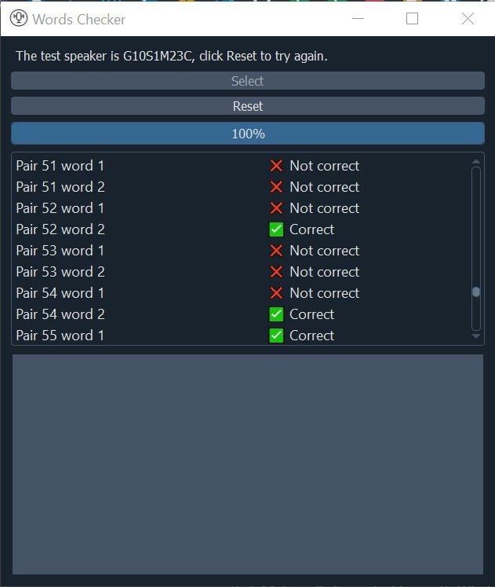

This is a PyQt5 interface for a speech processing project, for a digital signal processing course.
The purpose of the program is to help the speakers and the children to correctly pronounce the phonemes and some words of the Arabic language.
The user is asked to enter some pre-recorded list of words.
And after the words are compared to some references words, the user can know weither the phonemes are correct or there are some mistakes.
Only the interface code is uploaded without the implementation as I only worked on the interface in the team, and also the full project requires lots of other data and files.

